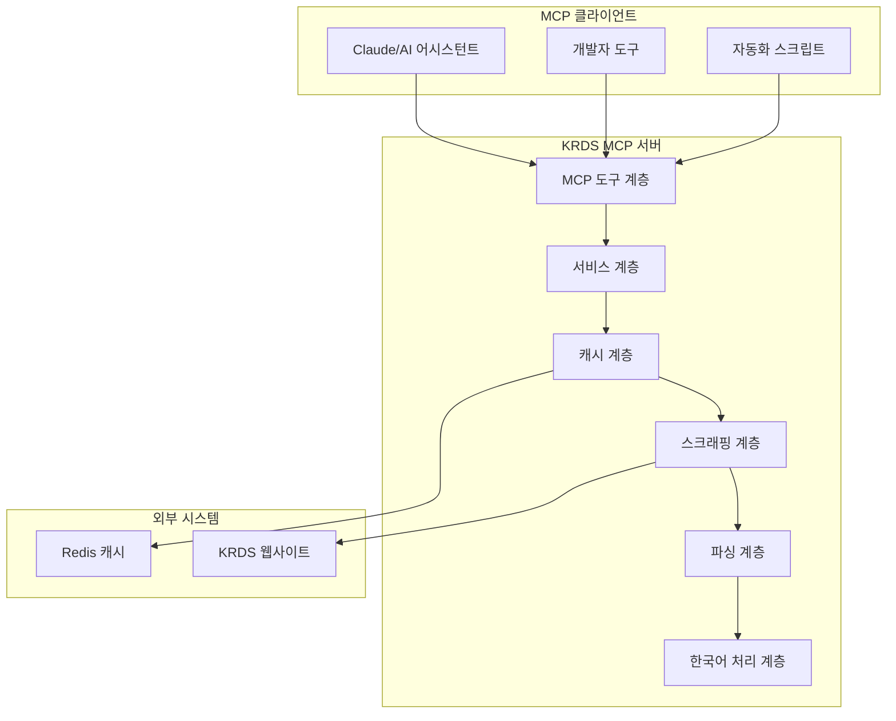

# KRDS MCP 서버 🇰🇷

[](https://opensource.org/licenses/MIT)
[](https://www.typescriptlang.org/)
[](https://nodejs.org/)
[](https://github.com/username/krds-mcp-server)

**KRDS (한국정보통신기술협회 데이터 서비스) MCP 서버**는 한국 정부 문서의 스크래핑, 처리, 분석을 위한 포괄적인 Model Context Protocol (MCP) 서버입니다. 이 서버는 KRDS 웹사이트 (https://v04.krds.go.kr)에서 정부 문서와 정책 자료를 효율적으로 수집하고 분석할 수 있는 강력한 도구를 제공합니다.

## 🌟 주요 특징

### 핵심 역량
- **🇰🇷 고급 한국어 처리**: 한국어 텍스트 분석, 로마자 변환, 형태소 분석, 키워드 추출
- **🧠 지능형 웹 스크래핑**: Puppeteer 기반의 강력한 스크래핑 엔진
- **⚡ 다층 캐싱 시스템**: 메모리, Redis, 파일 기반 캐싱으로 최적화된 성능
- **🛠️ 완전한 MCP 도구 세트**: 6가지 전문화된 도구로 모든 작업 지원
- **🚀 성능 최적화**: 동시 처리, 연결 풀링, 리소스 관리
- **🧪 철저한 테스트**: 85% 이상의 코드 커버리지

### 정부 및 공공기관 특화 기능
- **📋 정부 문서 형식 지원**: 공문서, 정책 자료, 법령 문서 등
- **🔍 의미론적 검색**: 한국어 자연어 처리를 활용한 지능형 검색
- **📊 정부 데이터 표준 준수**: 행정안전부 데이터 표준 가이드라인 준수
- **🔐 보안 및 개인정보 보호**: 정부 보안 정책에 부합하는 데이터 처리

## 🛠️ MCP 도구 개요

KRDS MCP 서버는 다음 6가지 전문화된 도구를 제공합니다:

| 도구명 | 기능 | 사용 사례 |
|--------|------|-----------|
| **krds_search** | 검색 및 문서 발견 | 키워드로 정부 문서 검색, 정책 자료 탐색 |
| **krds_content_retrieval** | 문서 내용 추출 | 완전한 문서 내용 및 메타데이터 획득 |
| **krds_navigation** | 사이트 구조 탐색 | 웹사이트 카테고리 및 계층 구조 탐색 |
| **krds_image_tools** | 이미지 처리 | 문서 이미지 다운로드, OCR, 분석 |
| **krds_export** | 데이터 내보내기 | 다양한 형식으로 데이터 변환 및 저장 |
| **krds_korean_text** | 한국어 텍스트 분석 | 한국어 자연어 처리 및 언어학적 분석 |

## 🏗️ 시스템 아키텍처



### 계층별 역할

1. **MCP 도구 계층**: 외부 인터페이스 및 요청 검증
2. **서비스 계층**: 비즈니스 로직 조정 및 처리
3. **캐시 계층**: 성능 최적화를 위한 다층 캐싱
4. **스크래핑 계층**: Puppeteer 기반 웹 스크래핑
5. **파싱 계층**: HTML 파싱 및 구조화된 데이터 추출
6. **한국어 처리 계층**: 한국어 특화 텍스트 처리

## 📦 설치 및 설정

### 시스템 요구사항

| 구성 요소 | 최소 버전 | 권장 버전 |
|-----------|-----------|-----------|
| Node.js | 18.0.0 | 20.0.0+ |
| npm | 9.0.0 | 10.0.0+ |
| TypeScript | 5.3.0 | 5.4.0+ |
| Redis | 6.0.0 | 7.0.0+ (선택사항) |
| 메모리 | 2GB | 4GB+ |
| 디스크 공간 | 1GB | 2GB+ |

### 빠른 시작

1. **저장소 복제 및 의존성 설치**
   ```bash
   git clone https://github.com/username/krds-mcp-server.git
   cd krds-mcp-server
   npm install
   ```

2. **환경 설정**
   ```bash
   cp .env.example .env
   # 필수 환경 변수 설정
   vim .env
   ```

3. **프로젝트 빌드 및 실행**
   ```bash
   npm run build
   npm start
   ```

4. **개발 모드 실행**
   ```bash
   npm run dev
   ```

### Docker를 통한 설치

```bash
# Docker 이미지 빌드
docker build -t krds-mcp-server .

# Docker Compose로 Redis와 함께 실행
docker-compose up -d

# 단일 컨테이너 실행
docker run -p 3000:3000 \
  -e NODE_ENV=production \
  -e REDIS_HOST=your-redis-host \
  krds-mcp-server
```

## ⚙️ 구성 및 설정

### 기본 환경 변수

```bash
# 서버 기본 설정
NODE_ENV=production
PORT=3000
LOG_LEVEL=info

# KRDS 웹사이트 연결 설정
KRDS_BASE_URL=https://v04.krds.go.kr
KRDS_TIMEOUT=30000
KRDS_RETRY_ATTEMPTS=3
KRDS_RETRY_DELAY=1000

# 속도 제한 설정
KRDS_RATE_LIMIT_ENABLED=true
KRDS_REQUESTS_PER_MINUTE=60
KRDS_CONCURRENT_REQUESTS=5

# 브라우저 설정
PUPPETEER_HEADLESS=true
PUPPETEER_TIMEOUT=30000
PUPPETEER_VIEWPORT_WIDTH=1920
PUPPETEER_VIEWPORT_HEIGHT=1080

# 캐싱 설정
CACHE_TYPE=memory,redis,file
CACHE_TTL=3600
CACHE_MAX_SIZE=104857600

# Redis 캐시 (선택사항)
REDIS_HOST=localhost
REDIS_PORT=6379
REDIS_PASSWORD=
REDIS_DB=0

# 한국어 처리 설정
KOREAN_PROCESSING_ENABLED=true
KOREAN_STEMMING_ENABLED=true
KOREAN_ROMANIZATION_ENABLED=true

# 보안 설정
CORS_ENABLED=true
HELMET_ENABLED=true
RATE_LIMIT_MAX_REQUESTS=100
```

### 정부기관 환경을 위한 고급 설정

```bash
# 보안 강화 설정
SECURITY_LEVEL=government
DATA_ENCRYPTION_ENABLED=true
AUDIT_LOGGING_ENABLED=true

# 네트워크 설정
PROXY_ENABLED=true
PROXY_HOST=your-proxy-server
PROXY_PORT=8080

# 데이터 보존 정책
DATA_RETENTION_DAYS=90
AUTO_CLEANUP_ENABLED=true

# 모니터링 설정
HEALTH_CHECK_ENABLED=true
METRICS_COLLECTION_ENABLED=true
PERFORMANCE_MONITORING=true
```

## 📚 MCP 도구 상세 가이드

### 1. 검색 도구 (krds_search)

정부 문서 및 정책 자료를 효율적으로 검색합니다.

**기본 사용법:**
```javascript
{
  "name": "krds_search",
  "arguments": {
    "query": "디지털 정부 혁신",
    "category": "행정",
    "maxResults": 20,
    "sortBy": "date",
    "sortOrder": "desc"
  }
}
```

**매개변수 상세:**
- `query` (필수): 검색 키워드 (한국어/영어 모두 지원)
- `category`: 검색 범위 ("교육", "보건", "경제", "행정" 등)
- `maxResults`: 최대 결과 수 (기본값: 10, 최대: 100)
- `sortBy`: 정렬 기준 ("date", "relevance", "title")
- `sortOrder`: 정렬 순서 ("asc", "desc")
- `dateRange`: 날짜 범위 필터
- `documentType`: 문서 유형 필터

**응답 예시:**
```javascript
{
  "success": true,
  "results": [
    {
      "id": "krds-2024-gov-001",
      "title": "디지털 정부 혁신 종합계획",
      "url": "https://v04.krds.go.kr/policy/digital/2024/plan",
      "summary": "정부 디지털 전환을 위한 종합적 정책 방향...",
      "agency": "행정안전부",
      "publishDate": "2024-01-15",
      "keywords": ["디지털정부", "혁신", "전자정부"],
      "relevanceScore": 0.95
    }
  ],
  "totalResults": 45,
  "executionTime": 1850
}
```

### 2. 콘텐츠 검색 도구 (krds_content_retrieval)

특정 문서의 완전한 내용과 메타데이터를 추출합니다.

**기본 사용법:**
```javascript
{
  "name": "krds_content_retrieval",
  "arguments": {
    "url": "https://v04.krds.go.kr/policy/education/2024/plan",
    "includeImages": true,
    "includeAttachments": true,
    "processKoreanText": true,
    "extractTables": true
  }
}
```

**매개변수 상세:**
- `url` 또는 `documentId`: 문서 URL 또는 고유 식별자
- `includeImages`: 이미지 추출 및 처리 (기본값: true)
- `includeAttachments`: 첨부 파일 포함 (기본값: true)
- `processKoreanText`: 한국어 텍스트 처리 (기본값: true)
- `extractTables`: 테이블 데이터 추출 (기본값: false)
- `format`: 출력 형식 ("json", "markdown", "html")

**응답 구조:**
```javascript
{
  "success": true,
  "document": {
    "metadata": {
      "title": "2024년 교육정책 발전방안",
      "agency": "교육부",
      "publishDate": "2024-01-15",
      "documentId": "edu-2024-001",
      "classification": "정책계획서",
      "language": "ko"
    },
    "content": {
      "text": "문서의 전체 텍스트 내용...",
      "summary": "문서 요약...",
      "chapters": [...],
      "tables": [...],
      "images": [...]
    },
    "korean_analysis": {
      "keywords": ["교육정책", "발전방안"],
      "sentiment": "positive",
      "readability": 7.5,
      "entities": ["교육부", "학생", "교사"]
    }
  }
}
```

### 3. 네비게이션 도구 (krds_navigation)

KRDS 웹사이트의 구조와 카테고리를 탐색합니다.

**사용 예시:**
```javascript
// 카테고리 목록 조회
{
  "name": "krds_navigation",
  "arguments": {
    "action": "list_categories"
  }
}

// 특정 카테고리 탐색
{
  "name": "krds_navigation",
  "arguments": {
    "action": "browse_category",
    "category": "교육",
    "depth": 3
  }
}

// 사이트맵 생성
{
  "name": "krds_navigation",
  "arguments": {
    "action": "generate_sitemap",
    "maxDepth": 2
  }
}
```

### 4. 이미지 도구 (krds_image_tools)

문서의 이미지를 처리하고 분석합니다.

**기능:**
- 이미지 다운로드 및 저장
- OCR을 통한 텍스트 추출
- 이미지 메타데이터 분석
- 한국어 텍스트 OCR 지원

**사용법:**
```javascript
{
  "name": "krds_image_tools",
  "arguments": {
    "action": "process_document_images",
    "documentUrl": "https://v04.krds.go.kr/doc/example",
    "ocrEnabled": true,
    "koreanOcr": true,
    "downloadPath": "./images/"
  }
}
```

### 5. 내보내기 도구 (krds_export)

데이터를 다양한 형식으로 내보냅니다.

**지원 형식:**
- **JSON**: 구조화된 데이터 형식
- **CSV**: 스프레드시트 호환 형식
- **Excel (XLSX)**: Microsoft Excel 형식
- **PDF**: 인쇄 가능한 문서 형식
- **XML**: 구조화된 마크업 형식
- **Markdown**: 문서 작성 형식

**사용 예시:**
```javascript
{
  "name": "krds_export",
  "arguments": {
    "documents": [/* 문서 배열 */],
    "format": "pdf",
    "includeImages": true,
    "includeMetadata": true,
    "filename": "정부정책-2024년도-종합",
    "templateName": "government_report"
  }
}
```

### 6. 한국어 텍스트 분석 도구 (krds_korean_text)

한국어 텍스트에 대한 고급 언어학적 분석을 수행합니다.

**분석 기능:**
- **형태소 분석**: 단어의 형태적 분해
- **키워드 추출**: 중요 키워드 식별
- **감정 분석**: 텍스트의 감정적 톤 분석
- **로마자 변환**: 한국어의 로마자 표기
- **가독성 분석**: 텍스트의 이해 용이성 측정

**사용법:**
```javascript
{
  "name": "krds_korean_text",
  "arguments": {
    "texts": [
      "정부는 디지털 혁신을 통해 국민 편의를 증진하고자 합니다."
    ],
    "includeRomanization": true,
    "includeSentiment": true,
    "extractKeywords": true,
    "analyzeStemming": true,
    "includeReadability": true
  }
}
```

**분석 결과:**
```javascript
{
  "success": true,
  "analyses": [{
    "originalText": "정부는 디지털 혁신을 통해 국민 편의를 증진하고자 합니다.",
    "romanized": "jeonggbuneun dijiteol hyeoksineul tonghae gungmin pyeoniuireul jeungjinhagoja hapnida",
    "keywords": ["정부", "디지털", "혁신", "국민", "편의"],
    "sentiment": {
      "score": 0.7,
      "label": "positive",
      "confidence": 0.85
    },
    "morphemes": ["정부", "는", "디지털", "혁신", "을", "통해"],
    "readability": {
      "score": 7.2,
      "level": "중급",
      "description": "고등교육 수준"
    },
    "statistics": {
      "wordCount": 8,
      "characterCount": 32,
      "sentenceCount": 1
    }
  }]
}
```

## 🧪 테스트

### 테스트 실행

```bash
# 전체 테스트 스위트 실행
npm test

# 특정 테스트 카테고리 실행
npm run test:unit          # 단위 테스트
npm run test:integration   # 통합 테스트
npm run test:e2e          # 엔드투엔드 테스트

# 커버리지 리포트 생성
npm run test:coverage

# 감시 모드에서 테스트 실행
npm run test:watch

# 특정 패턴으로 테스트 필터링
npm test -- --testNamePattern="Korean.*processing"
```

### 테스트 구조

```
tests/
├── unit/                    # 단위 테스트
│   ├── tools/              # MCP 도구 테스트
│   ├── services/           # 서비스 계층 테스트
│   ├── parsing/            # 파싱 로직 테스트
│   └── korean/             # 한국어 처리 테스트
├── integration/            # 통합 테스트
│   ├── workflow/           # 전체 워크플로 테스트
│   └── cache/              # 캐시 통합 테스트
├── e2e/                    # 엔드투엔드 테스트
│   ├── mcp-protocol/       # MCP 프로토콜 준수 테스트
│   └── performance/        # 성능 테스트
└── helpers/                # 테스트 유틸리티
```

### 한국어 처리 테스트

```typescript
describe('한국어 텍스트 처리 테스트', () => {
  it('정부 문서의 키워드를 정확히 추출해야 함', async () => {
    const text = '교육부는 2024년 새로운 교육정책을 발표했습니다.';
    const result = await koreanProcessor.extractKeywords(text);
    
    expect(result.keywords).toContain('교육부');
    expect(result.keywords).toContain('교육정책');
    expect(result.year).toBe('2024');
  });

  it('정부 기관명을 올바르게 식별해야 함', async () => {
    const agencies = ['교육부', '보건복지부', '행정안전부'];
    const results = await Promise.all(
      agencies.map(agency => koreanProcessor.identifyEntity(agency))
    );
    
    results.forEach(result => {
      expect(result.type).toBe('government_agency');
      expect(result.confidence).toBeGreaterThan(0.9);
    });
  });
});
```

## 🚀 성능 및 최적화

### 성능 벤치마크

| 작업 유형 | 평균 응답 시간 | 처리량 | 메모리 사용량 |
|-----------|----------------|--------|---------------|
| 문서 검색 | 1.2-2.5초 | 25-50 req/min | 50-100MB |
| 콘텐츠 추출 | 2.0-4.0초 | 15-30 req/min | 100-200MB |
| 한국어 분석 | 100-300ms | 200-600 req/min | 20-50MB |
| 이미지 처리 | 3.0-8.0초 | 8-20 req/min | 200-500MB |
| 캐시 히트 | 10-50ms | 1000+ req/min | 10-20MB |

### 최적화 기법

1. **연결 풀링**: 브라우저 인스턴스 재사용으로 초기화 시간 단축
2. **지능형 캐싱**: 다층 캐시 구조로 반복 요청 최적화
3. **병렬 처리**: 다중 문서 동시 처리로 처리량 향상
4. **메모리 관리**: 자동 가비지 컬렉션과 메모리 모니터링
5. **배치 처리**: 한국어 텍스트 배치 분석으로 효율성 향상

### 모니터링 엔드포인트

```bash
# 시스템 상태 확인
curl http://localhost:3000/health

# 상세 성능 메트릭
curl http://localhost:3000/metrics

# 캐시 통계
curl http://localhost:3000/cache/stats

# 도구별 사용 통계
curl http://localhost:3000/tools/stats
```

## 🛡️ 보안 및 규정 준수

### 정부 보안 정책 준수

1. **데이터 보호**
   - 개인정보 자동 식별 및 마스킹
   - 임시 데이터 자동 삭제
   - 암호화된 캐시 저장

2. **접근 제어**
   - IP 기반 접근 제한
   - API 키 인증
   - 사용량 기반 속도 제한

3. **감사 로깅**
   - 모든 요청/응답 로깅
   - 사용자 활동 추적
   - 보안 이벤트 모니터링

### 규정 준수 기능

- **개인정보보호법 준수**: 개인정보 자동 탐지 및 처리
- **정보통신망법 준수**: 네트워크 보안 정책 적용
- **전자정부법 준수**: 정부 시스템 연동 표준 준수

## 🔧 개발 및 기여

### 개발 환경 설정

```bash
# 저장소 포크 및 클론
git clone https://github.com/your-username/krds-mcp-server.git
cd krds-mcp-server

# 개발 의존성 설치
npm install

# 개발 서버 실행
npm run dev

# 코드 품질 도구 실행
npm run lint          # ESLint 검사
npm run format        # Prettier 포매팅
npm run typecheck     # TypeScript 타입 검사
```

### 새로운 도구 추가 가이드

1. **도구 파일 생성**
   ```typescript
   // src/tools/your-new-tool.ts
   import { Tool } from '@modelcontextprotocol/sdk/types.js';
   import { z } from 'zod';

   export const YourToolSchema = z.object({
     parameter: z.string().describe('매개변수 설명')
   });

   export const yourNewTool: Tool = {
     name: 'krds_your_tool',
     description: '새로운 도구의 기능 설명',
     inputSchema: zodToJsonSchema(YourToolSchema)
   };

   export async function handleYourTool(
     params: z.infer<typeof YourToolSchema>,
     context: ToolContext
   ) {
     // 도구 로직 구현
   }
   ```

2. **도구 등록**
   ```typescript
   // src/tools/index.ts에 추가
   import { registerYourNewTool } from './your-new-tool.js';

   export const TOOL_REGISTRY = [
     // 기존 도구들...
     {
       name: 'krds_your_tool',
       description: '새로운 도구',
       registerFunction: registerYourNewTool
     }
   ];
   ```

3. **테스트 작성**
   ```typescript
   // tests/unit/tools/your-new-tool.test.ts
   describe('YourNewTool', () => {
     it('should process input correctly', async () => {
       const result = await handleYourTool(testParams, testContext);
       expect(result.success).toBe(true);
     });
   });
   ```

### 코딩 표준

- **TypeScript**: 엄격한 타입 검사 사용
- **ESLint**: Airbnb 스타일 가이드 기반
- **Prettier**: 일관된 코드 포매팅
- **Zod**: 런타임 타입 검증
- **Jest**: 테스트 프레임워크

### 기여 절차

1. 이슈 생성 또는 기존 이슈 확인
2. 기능 브랜치 생성 (`feature/feature-name`)
3. 개발 및 테스트 작성
4. 코드 품질 도구 통과 확인
5. Pull Request 생성
6. 코드 리뷰 및 승인
7. 메인 브랜치에 병합

## 🚢 배포 및 운영

### 프로덕션 배포

```bash
# 프로덕션 빌드
npm run build

# 프로덕션 환경 변수 설정
export NODE_ENV=production
export REDIS_HOST=prod-redis-host
export LOG_LEVEL=warn

# PM2를 사용한 프로덕션 실행
npm install -g pm2
pm2 start ecosystem.config.js
```

### Docker 배포

```yaml
# docker-compose.yml
version: '3.8'
services:
  krds-mcp-server:
    build: .
    ports:
      - "3000:3000"
    environment:
      - NODE_ENV=production
      - REDIS_HOST=redis
    depends_on:
      - redis
      
  redis:
    image: redis:7-alpine
    ports:
      - "6379:6379"
```

### 환경별 설정

| 환경 | 설정 파일 | 특징 |
|------|-----------|------|
| 개발 | `.env.development` | 디버그 로깅, 낮은 캐시 TTL |
| 테스트 | `.env.test` | 메모리 캐시만 사용, 모의 데이터 |
| 스테이징 | `.env.staging` | 프로덕션 유사 환경, 테스트 데이터 |
| 프로덕션 | `.env.production` | 최적화된 성능, 보안 강화 |

### 모니터링 및 로깅

```bash
# 로그 실시간 모니터링
pm2 logs krds-mcp-server

# 성능 모니터링
pm2 monit

# 시스템 메트릭
curl http://localhost:3000/metrics | grep krds_

# 에러 로그 분석
grep "ERROR" logs/krds-mcp-server.log | tail -100
```

## 📖 추가 문서 및 리소스

### 상세 문서

- [🏗️ 시스템 아키텍처](./docs/ARCHITECTURE.md)
- [⚙️ 설정 가이드](./docs/configuration.md)
- [🚀 배포 가이드](./docs/deployment.md)
- [🇰🇷 한국어 처리](./docs/korean-processing.md)
- [🧪 테스트 가이드](./docs/testing.md)
- [🔧 API 문서](./docs/api.md)
- [🤝 기여 가이드](./docs/contributing.md)

### 커뮤니티 및 지원

- **GitHub 저장소**: [krds-mcp-server](https://github.com/username/krds-mcp-server)
- **이슈 트래커**: [GitHub Issues](https://github.com/username/krds-mcp-server/issues)
- **토론 포럼**: [GitHub Discussions](https://github.com/username/krds-mcp-server/discussions)
- **이메일 지원**: support@krds-mcp-server.com

### 교육 자료

- [MCP 프로토콜 가이드](./docs/mcp-protocol-guide.md)
- [한국어 NLP 기초](./docs/korean-nlp-basics.md)
- [정부 데이터 처리 모범 사례](./docs/government-data-best-practices.md)

## 🐛 문제 해결

### 자주 발생하는 문제

**Q: 한국어 텍스트 처리가 제대로 되지 않습니다.**
A: `KOREAN_PROCESSING_ENABLED=true` 설정을 확인하고, 한국어 처리 라이브러리가 올바르게 설치되었는지 확인하세요.

**Q: 스크래핑이 느리거나 실패합니다.**
A: 속도 제한 설정을 조정하고, KRDS 웹사이트의 응답 시간을 확인하세요. 프록시 설정이 필요할 수 있습니다.

**Q: 메모리 사용량이 높습니다.**
A: 캐시 크기를 조정하고, 불필요한 이미지 처리를 비활성화하세요.

### 디버깅 도구

```bash
# 디버그 모드 실행
DEBUG=krds:* npm run dev

# 메모리 프로파일링
node --inspect dist/server.js

# 성능 프로파일링
NODE_ENV=production node --prof dist/server.js
```

## 📄 라이선스

이 프로젝트는 MIT 라이선스 하에 배포됩니다. 자세한 내용은 [LICENSE](LICENSE) 파일을 참조하세요.

```
MIT License

Copyright (c) 2024 KRDS MCP Server Contributors

Permission is hereby granted, free of charge, to any person obtaining a copy
of this software and associated documentation files (the "Software"), to deal
in the Software without restriction, including without limitation the rights
to use, copy, modify, merge, publish, distribute, sublicense, and/or sell
copies of the Software, and to permit persons to whom the Software is
furnished to do so, subject to the following conditions:

The above copyright notice and this permission notice shall be included in all
copies or substantial portions of the Software.
```

## 🙏 감사 인사

### 기여자 및 후원자

- **한국정보통신기술협회 (TTA)**: 데이터 액세스 및 표준 제공
- **행정안전부**: 정부 데이터 표준 및 가이드라인 제공
- **MCP 개발팀**: Model Context Protocol SDK 및 지원
- **한국어 NLP 커뮤니티**: 언어 처리 라이브러리 개발
- **오픈소스 기여자들**: 코드, 문서, 테스트 기여

### 사용된 오픈소스 라이브러리

- [Puppeteer](https://puppeteer.dev/) - 웹 스크래핑 엔진
- [Cheerio](https://cheerio.js.org/) - HTML 파싱
- [Hangul.js](https://github.com/e-/Hangul.js) - 한국어 처리
- [Redis](https://redis.io/) - 캐싱 솔루션
- [TypeScript](https://www.typescriptlang.org/) - 개발 언어
- [Jest](https://jestjs.io/) - 테스트 프레임워크

---

**KRDS MCP 서버**는 한국의 정부 데이터 생태계 발전과 투명성 향상을 위해 개발되었습니다. 

🇰🇷 **대한민국의 디지털 정부 구현을 위해 노력합니다** 🇰🇷

---

*마지막 업데이트: 2024년 1월*
*버전: v1.0.0*
*문서 버전: 1.0*