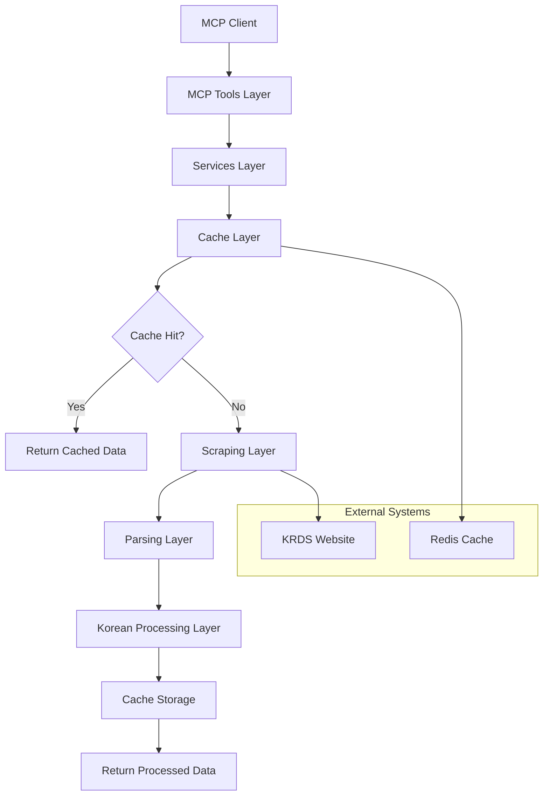

# KRDS MCP Server Architecture

## Overview

The KRDS MCP Server is built using a layered architecture pattern that promotes separation of concerns, maintainability, and scalability. The system is designed to efficiently scrape, process, and serve Korean government data while respecting rate limits and providing robust caching.

## Architecture Layers

### 1. MCP Tools Layer (`src/tools/`)
**Purpose**: External API interface for MCP clients
**Components**:
- `search.ts` - Search functionality with Korean language support
- `content-retrieval.ts` - Document content retrieval
- `navigation.ts` - Website structure navigation
- `export.ts` - Multi-format data export
- `image-tools.ts` - Image processing and download
- `korean-text.ts` - Korean text analysis tools

**Key Features**:
- Input validation using Zod schemas
- Standardized error handling
- Request/response logging
- Tool metadata registration

### 2. Services Layer (`src/services/`)
**Purpose**: Business logic orchestration and coordination
**Components**:
- `krds-service.ts` - Main KRDS website interaction service
- `content-service.ts` - Content management and processing
- `search-service.ts` - Search logic and result processing
- `export-service.ts` - Data export coordination

**Key Features**:
- Service lifecycle management
- Cross-cutting concerns (logging, caching)
- Business rule enforcement
- Data transformation

### 3. Scraping Layer (`src/scraping/`)
**Purpose**: Web scraping with Puppeteer
**Components**:
- `puppeteer-manager.ts` - Browser instance management
- `page-scraper.ts` - Page content extraction
- `content-extractor.ts` - Structured data extraction
- `image-scraper.ts` - Image download and processing

**Key Features**:
- Browser pool management
- Retry mechanisms with exponential backoff
- Rate limiting and respectful scraping
- Error recovery and fallbacks

### 4. Parsing Layer (`src/parsing/`)
**Purpose**: Content extraction and structure analysis
**Components**:
- `html-parser.ts` - HTML content parsing
- `document-parser.ts` - Document structure analysis
- `metadata-extractor.ts` - Metadata extraction

**Key Features**:
- Cheerio-based HTML parsing
- Content normalization
- Metadata standardization
- Text cleaning and preprocessing

### 5. Cache Layer (`src/cache/`)
**Purpose**: Performance optimization through caching
**Components**:
- `cache-manager.ts` - Cache abstraction layer
- `memory-cache.ts` - In-memory caching implementation
- `redis-cache.ts` - Redis caching implementation

**Key Features**:
- Multiple cache backends
- TTL-based expiration
- Cache statistics and monitoring
- Automatic cache invalidation

### 6. Korean Language Processing Layer (`src/korean/`)
**Purpose**: Korean-specific text processing
**Components**:
- `text-processor.ts` - Korean text normalization
- `romanization.ts` - Korean-to-Roman text conversion
- `keyword-extractor.ts` - Korean keyword extraction

**Key Features**:
- Hangul processing with Hangul.js
- Korean stemming and tokenization
- Romanization using korean-romanization
- Korean-specific search optimization

## Data Flow Architecture



## Key Design Patterns

### 1. Dependency Injection
Services are injected into tools and other services, promoting testability and loose coupling.

### 2. Factory Pattern
Used for creating browser instances, cache implementations, and parsers based on configuration.

### 3. Strategy Pattern
Different caching strategies (memory, Redis) and export formats are implemented as interchangeable strategies.

### 4. Observer Pattern
Event-driven architecture for cache invalidation and system monitoring.

### 5. Command Pattern
MCP tools implement a command pattern for standardized request/response handling.

## Configuration Management

### Environment-Based Configuration
- Development, staging, and production environments
- Environment variable validation
- Configuration schema validation with detailed error messages

### Hierarchical Configuration
```
Default Config → Environment Config → Runtime Config
```

## Error Handling Strategy

### 1. Layered Error Handling
- Tool level: Input validation and user-friendly messages
- Service level: Business logic errors and retries
- Infrastructure level: Network and system errors

### 2. Error Classification
- `NetworkError` - Network connectivity issues
- `ParsingError` - Content parsing failures
- `ValidationError` - Input validation failures
- `RateLimitError` - Rate limiting violations
- `KoreanProcessingError` - Korean text processing issues

### 3. Error Recovery
- Automatic retries with exponential backoff
- Graceful degradation when services are unavailable
- Fallback mechanisms for non-critical features

## Performance Optimizations

### 1. Caching Strategy
- **L1 Cache**: In-memory cache for frequently accessed data
- **L2 Cache**: Redis cache for shared data across instances
- **Cache Warming**: Proactive caching of popular content

### 2. Resource Management
- **Connection Pooling**: Browser instance pooling
- **Memory Management**: Automatic cleanup of large objects
- **Rate Limiting**: Respectful scraping with configurable limits

### 3. Korean Text Processing Optimization
- **Batch Processing**: Process multiple texts together
- **Memoization**: Cache Korean processing results
- **Lazy Loading**: Load Korean processing libraries on demand

## Security Considerations

### 1. Input Validation
- Comprehensive input validation using Zod schemas
- SQL injection prevention (though not applicable for web scraping)
- XSS prevention in content processing

### 2. Rate Limiting
- Per-client rate limiting
- Global rate limiting for KRDS website
- Exponential backoff for failed requests

### 3. Data Privacy
- No persistent storage of personal data
- Temporary caching with automatic expiration
- Secure handling of Korean government data

## Monitoring and Observability

### 1. Structured Logging
- JSON-structured logs for production
- Request/response correlation IDs
- Performance metrics logging

### 2. Health Checks
- Service health endpoints
- Dependency health monitoring
- Cache performance monitoring

### 3. Metrics Collection
- Request latency and throughput
- Cache hit/miss ratios
- Error rates by category
- Korean text processing performance

## Scalability Considerations

### 1. Horizontal Scaling
- Stateless service design
- Shared cache layer (Redis)
- Load balancing ready

### 2. Resource Efficiency
- Efficient memory usage
- Connection pooling
- Lazy loading of heavy dependencies

### 3. Performance Monitoring
- Real-time performance metrics
- Automatic scaling triggers
- Resource usage optimization

## Testing Strategy

### 1. Unit Testing
- Service layer unit tests
- Korean text processing tests
- Cache implementation tests

### 2. Integration Testing
- MCP tool integration tests
- Service interaction tests
- Cache integration tests

### 3. End-to-End Testing
- Full workflow testing
- Performance testing
- Korean language processing validation

This architecture ensures the KRDS MCP Server is maintainable, scalable, and efficient while providing robust Korean government data processing capabilities.