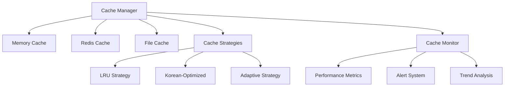

# KRDS Cache System

A comprehensive, multi-backend caching system optimized for Korean government data processing. Features intelligent caching strategies, Korean text optimization, and advanced monitoring capabilities.

## Features

### 🚀 **Multi-Backend Architecture**
- **Memory Cache**: High-speed LRU cache with Korean text optimization
- **Redis Cache**: Distributed caching with compression and clustering support
- **File Cache**: Persistent storage for large content and images

### 🇰🇷 **Korean Content Optimization**
- Korean text normalization and encoding
- Optimized compression for Hangul characters
- Cultural-aware caching strategies
- Korean search pattern optimization

### 🎯 **Intelligent Strategies**
- **LRU**: Least Recently Used eviction
- **LFU**: Least Frequently Used eviction  
- **TTL**: Time-based expiration
- **Size**: Size-aware caching decisions
- **Korean-Optimized**: Specialized for Korean content
- **Adaptive**: Dynamic strategy selection

### 📊 **Advanced Monitoring**
- Real-time performance metrics
- Hit/miss rate tracking with trends
- Backend performance comparison
- Korean content analytics
- Automated alerting system

## Architecture



## Quick Start

### Basic Setup

```typescript
import { initializeCacheSystem, CacheUtils } from '@/cache';
import { setupLogger } from '@/utils/logger.js';

// Initialize logger
const logger = setupLogger({
  level: 'info',
  consoleEnabled: true,
  fileEnabled: true,
});

// Initialize cache system
const cacheManager = await initializeCacheSystem({
  config: {
    type: ['redis', 'memory', 'file'],
    ttl: 2 * 60 * 60 * 1000, // 2 hours
    maxSize: 5000,
    redis: {
      host: 'localhost',
      port: 6379,
      enableCompression: true,
    },
  },
  logger,
  enableDistributed: true,
});
```

### Caching Documents

```typescript
import type { KrdsDocument } from '@/types';

// Cache a Korean document
const document: KrdsDocument = {
  id: 'doc-001',
  titleKorean: '정부 디지털 정책',
  contentKorean: '이 문서는...',
  // ... other fields
};

// Generate optimized cache key
const cacheKey = CacheUtils.generateKey('document', {
  id: document.id,
  agency: document.metadata.agency,
});

// Cache with Korean optimization
await cacheManager.set(cacheKey, document, {
  ttl: CacheUtils.getRecommendedTTL(document),
  strategy: 'korean-optimized',
  tags: CacheUtils.generateTags(document),
  priority: 'high',
});
```

### Retrieving from Cache

```typescript
// Get document from cache
const cached = await cacheManager.get<KrdsDocument>(cacheKey);

if (cached) {
  console.log('Cache hit!', cached.titleKorean);
} else {
  console.log('Cache miss - need to fetch from source');
}
```

## Configuration Options

### Cache Config

```typescript
interface CacheConfig {
  // Backend configuration
  type: 'memory' | 'redis' | 'file' | Array<'memory' | 'redis' | 'file'>;
  ttl: number;
  maxSize: number;
  
  // Redis configuration
  redis?: {
    host: string;
    port: number;
    password?: string;
    enableCompression?: boolean;
    enablePubSub?: boolean;
    cluster?: {
      nodes: string[];
    };
  };
  
  // File cache configuration
  file?: {
    baseDir?: string;
    maxSizeMB?: number;
    enableCompression?: boolean;
  };
  
  // Strategy configuration
  strategy?: {
    defaultStrategy?: 'lru' | 'lfu' | 'korean-optimized' | 'adaptive';
    koreanContentBoost?: number;
    enablePredictive?: boolean;
  };
  
  // Monitoring configuration
  monitoring?: {
    enabled?: boolean;
    metricsInterval?: number;
    alertThresholds?: {
      hitRateMin?: number;
      latencyMax?: number;
    };
  };
}
```

## Cache Strategies

### LRU (Least Recently Used)
Best for: General purpose caching with time-based access patterns

```typescript
await cacheManager.set(key, value, { strategy: 'lru' });
```

### Korean-Optimized
Best for: Korean government documents and text-heavy content

```typescript
await cacheManager.set(key, koreanDocument, { 
  strategy: 'korean-optimized',
  priority: 'high' 
});
```

### Adaptive
Best for: Mixed workloads with varying patterns

```typescript
await cacheManager.set(key, value, { 
  strategy: 'adaptive' // Automatically selects best strategy
});
```

## Monitoring & Analytics

### Real-time Monitoring

```typescript
const monitor = cacheManager.getMonitor();

// Listen to performance events
monitor.on('alert', (alert) => {
  console.warn('Performance alert:', alert.message);
});

// Get current metrics
const metrics = monitor.getCurrentMetrics();
console.log(`Hit rate: ${(metrics.performance.hitRate * 100).toFixed(1)}%`);
```

### Health Checks

```typescript
import { CacheMetrics } from '@/cache';

const healthCheck = await CacheMetrics.quickHealthCheck(cacheManager);

console.log(`Status: ${healthCheck.healthy ? 'HEALTHY' : 'NEEDS ATTENTION'}`);
healthCheck.recommendations.forEach(rec => console.log(`- ${rec}`));
```

### Performance Analysis

```typescript
const monitor = cacheManager.getMonitor();
const trends = monitor.analyzeTrends('hour');

trends.forEach(trend => {
  console.log(`${trend.metric}: ${trend.trend} (${trend.change.toFixed(1)}%)`);
});
```

## Advanced Usage

### Cache Warming

```typescript
// Warm up cache with common Korean search terms
await cacheManager.warmup({
  keys: [
    'kr:search:정부',
    'kr:search:정책',
    'kr:category:공고'
  ],
  batchSize: 10,
  concurrency: 3,
});
```

### Tag-based Invalidation

```typescript
// Tag entries during caching
await cacheManager.set(key, document, {
  tags: ['agency:디지털정부부', 'category:정책', 'korean']
});

// Invalidate by tags
const invalidated = await cacheManager.invalidate({
  tags: ['agency:디지털정부부']
});
```

### Batch Operations

```typescript
// Batch get operations
const results = await cacheManager.mget([key1, key2, key3]);

// Batch set operations  
await cacheManager.mset(new Map([
  [key1, doc1],
  [key2, doc2],
  [key3, doc3]
]));
```

## Performance Guidelines

### Memory Cache
- **Best for**: Small, frequently accessed data
- **Size limit**: 100MB recommended
- **TTL**: 1-4 hours for Korean content

### Redis Cache
- **Best for**: Distributed deployments, medium-sized data
- **Features**: Compression, pub/sub, clustering
- **TTL**: 2-8 hours for Korean content

### File Cache
- **Best for**: Large documents, images, attachments
- **Size limit**: 2GB recommended
- **Features**: Compression, persistent storage

## Korean Content Optimization

The cache system includes specialized optimizations for Korean content:

### Text Normalization
```typescript
// Automatic Korean text normalization
const key = CacheUtils.generateKey('search:정부정책');
// Results in normalized, cache-safe key
```

### Compression Optimization
- Hangul-aware compression algorithms
- Better compression ratios for Korean text
- Automatic encoding detection

### Cultural Patterns
- Korean search pattern recognition
- Government agency name normalization
- Date/time format optimization

## Error Handling

```typescript
try {
  const result = await cacheManager.get(key);
} catch (error) {
  if (error.type === 'CACHE_ERROR') {
    // Handle cache-specific errors
    console.error('Cache operation failed:', error.message);
  } else {
    // Handle other errors
    console.error('Unexpected error:', error);
  }
}
```

## Best Practices

### 1. Key Naming
```typescript
// Good: Hierarchical, normalized keys
const key = CacheUtils.generateKey('document', {
  agency: 'ministry-of-interior',
  category: 'policy',
  id: 'doc-123'
});

// Avoid: Raw, non-normalized keys
const badKey = '정부/정책/문서-123';
```

### 2. TTL Selection
```typescript
// Use content-aware TTL
const ttl = CacheUtils.getRecommendedTTL(document);

// Different TTLs for different content types
const searchTTL = 30 * 60 * 1000;    // 30 minutes
const documentTTL = 2 * 60 * 60 * 1000; // 2 hours
const imageTTL = 24 * 60 * 60 * 1000;   // 24 hours
```

### 3. Strategy Selection
```typescript
// Korean content
await cache.set(key, koreanDoc, { strategy: 'korean-optimized' });

// Large files
await cache.set(key, largeFile, { strategy: 'size', forceBackend: 'file' });

// Frequently accessed
await cache.set(key, popularData, { strategy: 'lfu', priority: 'high' });
```

### 4. Monitoring
```typescript
// Set up comprehensive monitoring
const monitor = cacheManager.getMonitor();

monitor.on('alert', handleAlert);
monitor.on('stats', logPerformance);

// Regular health checks
setInterval(async () => {
  const health = await CacheMetrics.quickHealthCheck(cacheManager);
  if (!health.healthy) {
    notifyAdministrator(health);
  }
}, 10 * 60 * 1000); // Every 10 minutes
```

## Troubleshooting

### Common Issues

**Low Hit Rate**
- Check TTL settings (may be too short)
- Verify key generation consistency
- Review eviction strategy

**High Latency**
- Check backend health
- Review network configuration
- Consider increasing memory cache size

**Memory Issues**
- Adjust memory limits
- Enable compression
- Implement better eviction policies

**Korean Text Issues**
- Ensure proper Unicode normalization
- Check encoding settings
- Verify Korean pattern detection

### Debugging

```typescript
// Enable debug logging
const logger = setupLogger({ level: 'debug' });

// Monitor specific operations
cacheManager.on('operation', (event) => {
  if (event.latency > 1000) {
    console.warn('Slow cache operation:', event);
  }
});

// Analyze access patterns
const patterns = cacheStrategies.getStrategyStats();
console.log('Access patterns:', patterns);
```

## Examples

See `cache-example.ts` for complete integration examples including:

- Production configuration setup
- Document caching workflows
- Search result optimization
- Performance monitoring
- Health check automation

## API Reference

### CacheManager
- `get<T>(key, options?)` - Retrieve cached value
- `set<T>(key, value, options?)` - Store value in cache
- `delete(key)` - Remove cached value
- `clear()` - Clear all cached values
- `has(key)` - Check if key exists
- `invalidate(options)` - Invalidate by tags/patterns

### CacheUtils
- `generateKey(base, params?)` - Generate normalized cache key
- `isKoreanContent(content)` - Detect Korean content
- `getRecommendedTTL(content, pattern?)` - Calculate optimal TTL
- `generateTags(content, type?)` - Generate content tags

### CacheMetrics
- `quickHealthCheck(manager)` - Perform health check
- `calculateEfficiencyScore(metrics)` - Calculate performance score

For complete API documentation, see the TypeScript interfaces in each module.